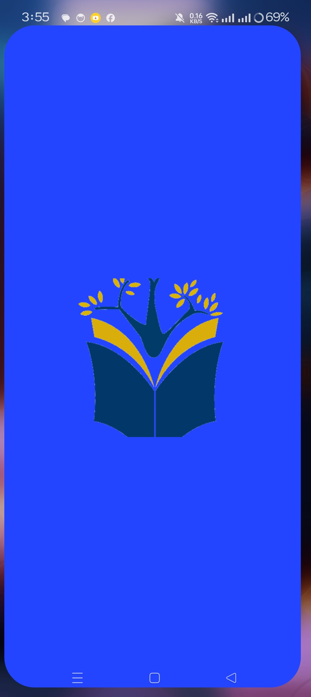
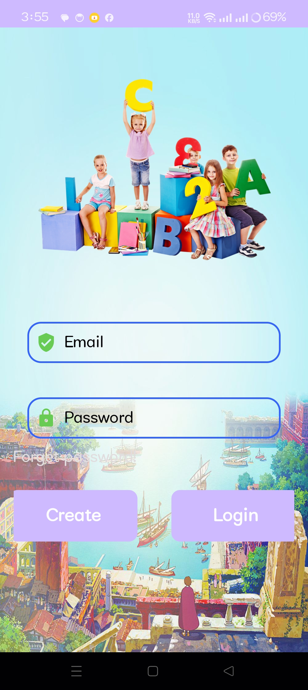
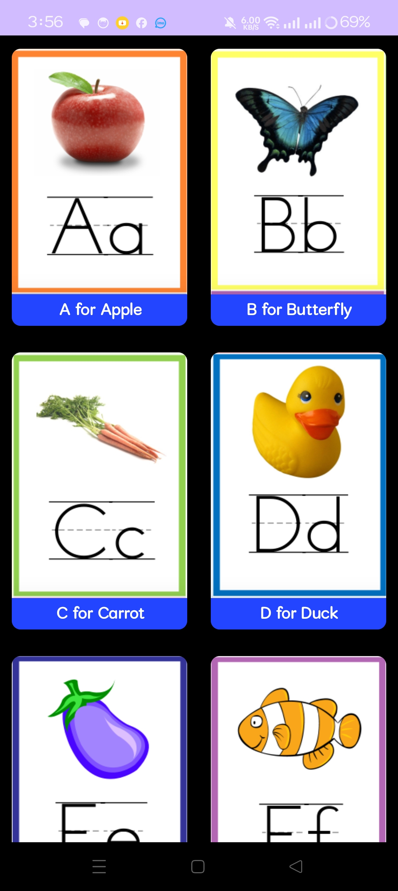

     
#    
     
# Child Learning App
        
This app implements this awesome [library](https://github.com/prolificinteractive/material-calendarview)

## Screenshots
<table align="center">
        <tr>
          <td></td>
          <td></td>
          <td></td>
          <td></td>
          <td></td>
          <td></td>
          <td></td>
         
        </tr>
      <tr>
         <td></td>
           <td></td>
           <td></td>
      </tr>
</table> 

### Built With
-  [kotlin](https://kotlinlang.org/)
-  [Architecture Components](https://developer.android.com/topic/libraries/architecture)
-  [ViewModel](https://developer.android.com/topic/libraries/architecture/viewmodel)
-  [Coroutines](https://developer.android.com/kotlin/coroutines)
-  [Navigation](https://developer.android.com/guide/navigation/navigation-getting-started)
-  [ConstraintLayout](https://developer.android.com/reference/androidx/constraintlayout/widget/ConstraintLayout)
-  [ImageSlider](https://github.com/daimajia/AndroidImageSlider)
-  [material ui](http://material.io/)
-  [DataBinding](https://developer.android.com/topic/libraries/data-binding)
-  [Glide](https://github.com/bumptech/glide)
-  [material-calendarview](https://github.com/prolificinteractive/material-calendarview)
